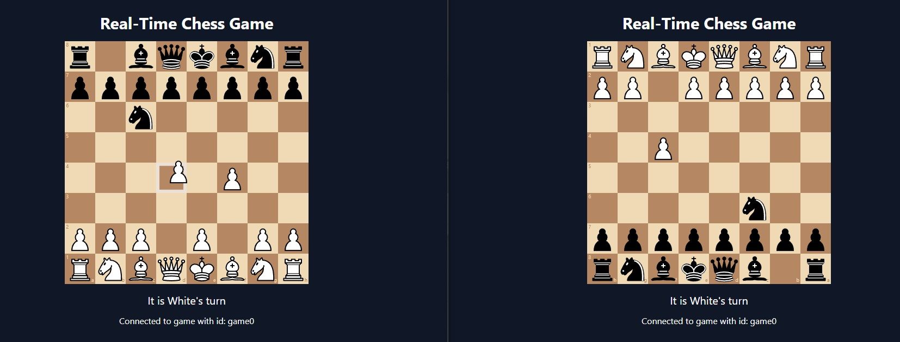

# Real-Time Multiplayer Chess Game

A real-time multiplayer chess game built using React, TypeScript, Socket.IO, and Node.js, where players can play from different browser windows. Move validation occurs both on the frontend and backend, ensuring a synchronized and fair experience.

<p align="center">  </p>
<p>(Gameplay)</p>


<p align="center"></p>
<p>(Joining game screen)</p>

## Features
Real-time 1v1 chess using WebSockets.

- Players join to the game using unique Game IDs.
- Move validation on both client and server using chess.js.
- Displays current player turn and board orientation.
- Simple, responsive, and elegant UI.

## Project Structure
```
├── frontend/                 # Frontend (React + TypeScript)
│   ├── src/
│   │   └── ChessGame.tsx     # Main game component
├── assets/                   # Game assets like images/logos
├── components/
│   │   └── ChessGame.tsx     # Main game component
│   └── ...
|   App.tsx
|   main.tsx                  # Main React access point
|   game.dto.ts               # Type definitions for receiving messages
|   index.css                 # Tailwind Styling      
├── backend/src/              # Backend (Node.js + Socket.IO)
│   ├── index.ts              # Socket server logic
│   ├── game.dto.ts           # Type definitions for messages
│   └── ...
├── screenshots/              # Game screenshots for README
│   └── game.png
├── README.md
├── package.json
└── ...
```
## How is concurrency achieved in our game

Our game is written in JavaScript and JavaScript has only one thread - it uses an event loop with non-blocking I/O to achieve concurrency.

In our project, we are using a library Socket.IO that is basically a custom proctol built on top of WebSockets and is a very popular choice among developers.
It establishes one TCP/IP connection and is much faster than REST API would be. It also enables real-time, bi-directional communication between web clients and servers
which is perfect for our chess game where the players constantly make moves and want a response from the server without delay. We could have also used WebSockets but
Socket.IO has many advantages over the normal WebSocket library such as automatic reconnection, event-based messaging, and support for broadcasting events/messages to multiple clients.

From the technical perspective, Socket.IO achieves concurrency with event-driven, non-blocking I/O model, allowing it to handle many client connections simultaneously without using multiple threads. 
It processes each socket event asynchronously through the event loop, which results in concurrent communication across all connected clients.

When 2 players join the game, on the backend their sockets join the same Socket.IO room which allows later for sending moves to all participants in the room - so that when one
player makes a move, the second player also gets and sees it.


## Libraries and Tools used
Frontend:
- React
- react-chessboard
- chess.js – for validation and basic game logic
- Socket.IO (client)
- react-hot-toast
- Tailwind CSS

Backend:
- Express
- Socket.IO
- chess.js – for server-side move validation

## Contributions
- Paweł Blicharz - Frontend components, basic template of the frontend-backend communication; Code refactorizations
- Stanisław Pinkiewicz - Backend components, Minor frontend components, elements of comunications
- Jakub Czermański - Handling multiple user connections on backend and frontend, tracking game state on backend, re-factoring frontend
